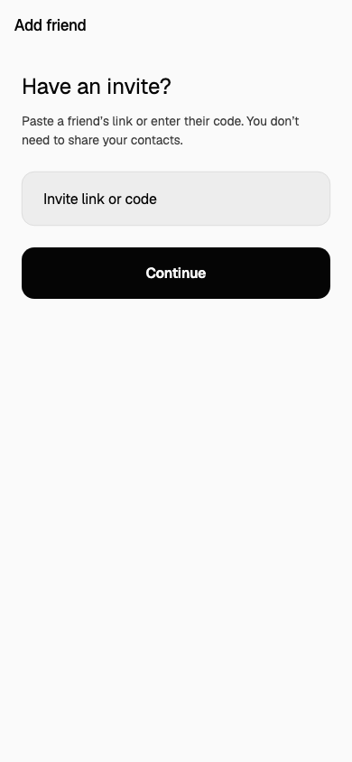
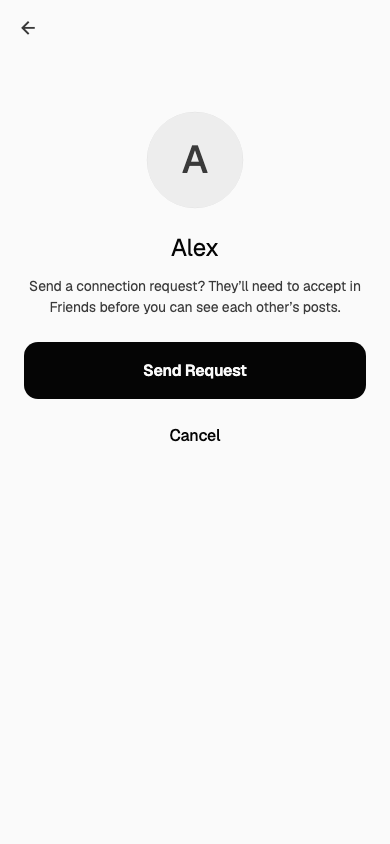

# Invite and onboarding incident — 2026-09-19

Priority: high. Existing users who decline contacts can be unable to connect at all. Code fixes are prepared for review; production code and store releases have not been performed. The production API invite-host allowlist was updated on September 19; see the release status below.

## Diagnosis

1. **No manual entry after signup.** The app replaced legacy invite-code management with a personal link card, but only the registration form accepted incoming links/codes. Friends, Settings and onboarding offered sharing or contacts, not receiving an invite.
2. **Wrong domains in the packaged iOS app.** The embedded XML entitlement document in the local `aside-1.4.0+51-cebf437e8403e12eb107a27ffd4f56189825fb2a.ipa` has `applinks:example.com` and `applinks:www.example.com`. The public repository intentionally uses development domains; the hosted overlay patched Android but omitted iOS. This establishes a release-artifact defect, though the reporter's exact installed version is unknown.
3. **Safari self-link.** The live invite page assigns its current HTTPS URL to “Open A/SIDE.” Same-domain navigation can remain in Safari, reloading the landing page. [Apple documents this behavior](https://developer.apple.com/library/archive/documentation/General/Conceptual/AppSearch/UniversalLinks.html).
4. **Association delivery is also wrong.** Read-only HTTP checks on September 19 found the apex `/.well-known/apple-app-site-association` returning 307 to `www`. The `www` response is 200 with `application/octet-stream`. Both should serve the association JSON directly. The app's configured host list previously omitted `www`.
5. **Authentication discards invites.** The app drained its pending link while unauthenticated, the router redirected to sign-in, and the pending value was cleared. New-registration navigation also ran from a screen that auth could already have disposed.
6. **Two deep-link handlers compete.** The app uses `app_links` but did not disable Flutter's default handler. [Flutter requires opting out when using a plugin](https://docs.flutter.dev/ui/navigation/deep-linking).
7. **Related reliability gaps.** Follow/request edges and their durable notifications were separate database writes; failed notifications could leave partially completed requests. First-time concurrent invite-link fetches could overwrite each other. Contact-permission replies could update disposed screens, and request-loading errors were hidden.

## Implemented solution

- Add a dedicated link/code entry screen reachable from Friends, Settings, onboarding, and the contacts screen. Add a Friends action to the empty feed and explain manual entry in the welcome sheet. Contacts remain optional.
- Use one production parser for manual entry and OS links: trusted HTTPS/HTTP hosts, bare 12-character codes, legacy `/join/<code>`, whitespace, trailing slashes, and case-normalized personal slugs. Reject foreign hosts, credentials, extra path segments and unsupported schemes. Legacy codes retain case.
- Show the invite owner and require confirmation before requesting or redeeming. Preserve personal-link consent semantics: a request alone does not expose posts; the recipient accepts in Friends. Legacy codes retain their existing mutual-connection semantics.
- Retain pending links until authentication succeeds. Use the same listener for cold/warm links, deduplicate the current destination, preserve a Back path, handle startup races and dispose subscriptions. The production router selects onboarding after registration rather than relying on the disposed sign-in screen.
- Make request creation and acceptance share a transaction for the follow and notification. Serialize both directions of each pair. Duplicate submissions remain idempotent. Push failures are caught after commit. Legacy registration emits mutual notifications, rejects deleted inviters, and rechecks expiry during consumption. Revocation cannot overwrite a code consumed concurrently.
- Generate iOS entitlements and Android manifest hosts from the same hosted `APP_LINK_HOSTS`. Include apex and `www`, legacy paths, and trailing slashes. Disable Flutter's competing handler.
- Register an explicit `aside://invite/<code>` / `aside://join/<code>` handoff. The website Open button uses it instead of its own URL; the page also includes a Smart App Banner, a readable code, clipboard feedback and clear signup/existing-user instructions. There is no automatic connection or automatic redirect loop.
- Add JSON response headers for association files. **Removing the existing Vercel apex-to-www domain redirect remains a production configuration step; repository headers alone cannot override it.**

## Regression coverage

| Journey or failure | Verification |
| --- | --- |
| Existing user enters a link without contacts | Manual-entry widget tests; production parser; API preview → request → acceptance → mutual Friends lists |
| Existing user enters an old code | Actual confirmation widget previews the owner, calls legacy redemption only after confirmation; API legacy tests |
| New user with no invite, personal slug/URL or legacy `/join` URL | OTP/signup API tests, rollback tests, production registration-router test |
| Invite arrives before login, on cold start, or while running | Production pending-link listener tests; actual signup router; startup stream race and disposal tests |
| Same link delivered twice | One confirmation screen, one Back step; idempotent API tests |
| Contacts denied or permission reply arrives after navigation | Actual native-channel mock on both onboarding and Settings screens; no contact upload; manual entry remains reachable |
| Expired, revoked, rotated, deleted-owner, self, malformed or foreign invite | API/slug/parser and stale-link widget tests |
| Offline lookup or send failure | Visible retry, input retained, no accidental fallback to a legacy redemption |
| Simultaneous opposing requests and duplicate acceptance | Pair serialization and exact notification-count assertions |
| Database notification failure | Injected trigger failure rolls back the follow; retry succeeds |
| Push-service or push-preference failure | Dedicated unit tests prove committed connection success is preserved |
| First invite-link reads in parallel | All callers receive the same saved link |
| Browser Open, legacy URL, clipboard success/failure, unknown path | Website production-script tests and local browser checks |
| Hosted native configuration | Overlay regression test inspects iOS plist and Android XML host/path sets |

The old invite tests copied URL parsing and navigation into a test harness; the replacement exercises the production parser and listener. A pre-existing group-admin test had assumed distinct `NOW()` timestamps within one transaction; its fixture now explicitly makes the expected member older, without changing group behavior.

## Validation and limits

Backend: `npm run lint`; run the Jest suite using a dedicated disposable PostgreSQL database. The integration harness drops its test schema; never point it at production. Mobile: `flutter test`, `flutter analyze lib test`. Website: `npm run build`, `npm run test:invites`. Hosted overlay: `bash scripts/test-app-links.sh ../aside`. Native plist: `plutil -lint mobile/ios/Runner/Info.plist`.

Final results: **448 backend tests across 12 suites passed on Node 24.19.0 after updating the PR branch to the latest main; 414 mobile tests passed; 5 website tests passed; hosted iOS/Android overlay checks passed; TypeScript lint, app/test Dart analysis, native plist validation and website build passed.** The unscoped `flutter analyze` additionally scans the vendored Rust build-tool package and reports its missing standalone dependencies/documentation warnings; application and test analysis is evaluated separately. A Node 26 full-suite rerun produced intermittent unrelated socket/test failures; the final verification also uses the bundled Node 24 LTS runtime.

Unit/integration/browser checks cannot prove iOS association caching, store signing, installation handoff, real OTP email delivery or physical-device behavior. These remain release gates, not claimed successes.

## Release sequence and physical-device acceptance

1. Review and release the API changes. Production `INVITE_LINK_ALLOWED_HOSTS=a-side.social,www.a-side.social` is already applied: only the API container was recreated, its image stayed unchanged, the database container was unchanged, and local/public health returned HTTP 200. The previous environment was backed up on the host. Verify the emitted invite URL uses an associated host. No database migration is required by these invite fixes.
2. Build a new store version through the repaired hosted overlay. Inspect the **signed IPA** entitlements for real domains and inspect the **signed Android app** for both hosts/path variants. Verify the App Store/Play signing identifiers against the association files.
3. Configure Vercel to serve **both hosts directly**, including association endpoints; do not keep a host-level redirect intercepting them. Deploy the website repair with JSON headers. Coordinate the new Open scheme/manual-entry instructions with availability of the updated app.
4. On physical iPhone and Android devices, test fresh and upgraded installs; app absent, terminated, backgrounded and foregrounded; signed in and signed out; Mail/Messages, Safari, QR and pasted links. Test the apex and `www`, and legacy `/join` links. Inspect association verification on the actual devices.
5. Use two test accounts to complete OTP → signup → skip/deny contacts → paste invite → preview → request → recipient opens Friends → accept → both see the connection and a newly shared post. Repeat with an existing account. Never require contacts to finish this journey.
6. Test cancellation, offline/reconnect, invalid/expired/revoked code, rotated link, self-invite, already-pending/already-connected, repeated taps, declined request, and another-account sign-in. Confirm that no new request is sent merely by opening a link.
7. Uninstall/install does not promise deferred invite retention. Verify the documented copy/paste or return-to-original-link path after installation. Confirm that opening an invite in Safari always leaves readable recovery instructions.
8. Only after those checks and store availability should support describe the issue as fixed. No customer email was sent by this task.

PR changes span the public `aside` repository, `aside-deploy` build scripts/configuration, and `kin/web` marketing site. Existing unrelated website edits were left intact.

## UI review evidence

These images render the production widgets with the app theme and fictional test data at 390×844. They are widget renders, not physical-device screenshots.

